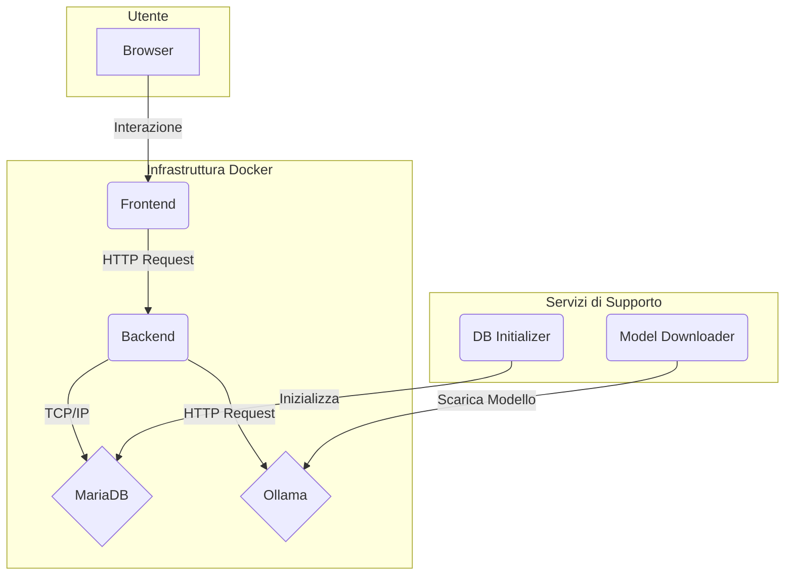

# CulturaLLM

CulturaLLM è una piattaforma web interattiva progettata per esplorare e approfondire la cultura italiana attraverso un sistema di domande e risposte gamificato. L'applicazione sfrutta un Large Language Model (LLM) per generare risposte che vengono confrontate e validate dagli utenti insieme a quelle fornite da altri partecipanti, creando un ecosistema di apprendimento collaborativo e validazione comunitaria.

## Architettura

Il progetto è basato su un'architettura a microservizi gestita tramite Docker Compose. Questa scelta garantisce modularità, scalabilità e facilità di deployment.



### Servizi Principali
- **Frontend**: Applicazione React.js che fornisce l'interfaccia utente.
- **Backend**: API server basato su FastAPI (Python) che gestisce tutta la logica di business.
- **MariaDB**: Database relazionale per la persistenza dei dati (utenti, domande, risposte, validazioni).
- **Ollama**: Serve il modello linguistico (es. `gemma3:1b`) per la generazione di risposte da parte dell'IA.

### Servizi di Supporto
- **db_init**: Container di servizio che inizializza lo schema del database al primo avvio, se vuoto.
- **ollama_model_downloader**: Container di servizio che scarica il modello LLM richiesto se non è già presente localmente.

---

## Backend (Focus: 90%)

Il backend è il cuore del sistema e gestisce la logica applicativa, l'interazione con il database e l'integrazione con il modello LLM.

### Tecnologie Utilizzate
- **Linguaggio**: Python 3.11+
- **Web Framework**: **FastAPI** per la creazione di API performanti e moderne, con documentazione automatica (Swagger UI & ReDoc).
- **ORM**: **SQLAlchemy** per l'interazione con il database MariaDB, garantendo un mapping efficiente tra oggetti Python e tabelle relazionali.
- **Modelli Dati**: **Pydantic** per la validazione dei dati, la serializzazione e la definizione degli schemi API.
- **Autenticazione**: Gestita tramite token **JWT (JSON Web Tokens)**, con hashing delle password utilizzando `passlib`.
- **Integrazione LLM**: Tramite richieste HTTP dirette al servizio Ollama con la libreria `requests`.
- **Containerizzazione**: **Docker** per l'impacchettamento dell'applicazione e delle sue dipendenze.

### Struttura del Progetto
```
backend/src/backend/
├── main.py             # Entry point dell'applicazione FastAPI
├── models/
│   └── schemas.py      # Modelli SQLAlchemy e schemi Pydantic
├── routers/
│   ├── auth.py         # Endpoint per autenticazione (login, registrazione)
│   ├── question.py     # Endpoint per la gestione delle domande
│   ├── answer.py       # Endpoint per la sottomissione delle risposte
│   ├── validate.py     # Endpoint per la validazione delle risposte
│   └── leaderboard.py  # Endpoint per la classifica utenti
└── services/
    ├── database.py     # Configurazione e sessioni del database
    └── llm_service.py  # Logica per l'interazione con Ollama
```

### Endpoint API Principali
Il backend espone una serie di endpoint RESTful per gestire il flusso dell'applicazione:
- `POST /api/auth/register`: Registrazione di un nuovo utente.
- `POST /api/auth/login`: Login di un utente e generazione di un token JWT.
- `GET /api/questions/random`: Ottiene una domanda casuale a cui rispondere.
- `POST /api/questions/`: Crea una nuova domanda (funzionalità per admin/moderatori).
- `POST /api/answers/`: Invia una risposta (umana o generata da AI) a una domanda.
- `GET /api/validate/pending`: Ottiene una coppia di risposte (umana e AI) da validare.
- `POST /api/validate/`: Invia la validazione (punteggio e feedback) per una risposta.
- `GET /api/leaderboard/`: Ottiene la classifica degli utenti basata sui loro punteggi.

### Logica di Business Chiave

#### Generazione Risposta AI (`llm_service.py`)
Quando un utente risponde a una domanda, il backend invia una richiesta al servizio Ollama. Il prompt viene costruito dinamicamente per includere il contesto culturale e la domanda stessa, istruendo l'LLM a fornire una risposta concisa e pertinente.

#### Validazione delle Risposte (`validate.py`)
Questo è un processo centrale. Gli utenti (validatori) ricevono una coppia di risposte (una umana, una AI) per la stessa domanda. Attraverso l'interfaccia, assegnano un punteggio che il backend registra. Questo punteggio contribuisce allo score dell'utente che ha fornito la risposta e all'affidabilità generale del modello.

### Dipendenze Chiave (`requirements.txt`)
- `fastapi`: Framework web.
- `uvicorn`: ASGI server per FastAPI.
- `sqlalchemy`, `pymysql`: Interazione con MariaDB.
- `python-jose`, `passlib[bcrypt]`: Gestione JWT e hashing password.
- `requests`: Per le chiamate API a Ollama.
- `pydantic`: Validazione dati.

---

## Frontend (Focus: 10%)

L'interfaccia utente è un'applicazione Single Page Application (SPA) costruita per essere reattiva e intuitiva.

### Tecnologie Utilizzate
- **Libreria UI**: **React.js** (v18) con functional components e Hooks.
- **Routing**: **React Router DOM** per la navigazione tra le diverse sezioni (login, dashboard, validazione, etc.).
- **Comunicazione API**: **Axios** per effettuare chiamate HTTP al backend FastAPI.
- **Styling**: CSS puro con una struttura BEM-like per la manutenibilità.
- **Build Tool**: `react-scripts` (Create React App).

### Componenti Principali
- **`Login`/`Register`**: Gestiscono l'autenticazione utente.
- **`Dashboard`**: Pagina principale dopo il login, punto di accesso alle funzioni principali.
- **`AnswerQuestion`**: Componente per visualizzare una domanda e inviare una risposta.
- **`ValidateAnswers`**: Interfaccia di validazione con la progress bar dinamica per assegnare un giudizio qualitativo.
- **`Leaderboard`**: Visualizza la classifica degli utenti.

---

## Come Avviare il Progetto

Per eseguire il progetto in locale, è necessario avere Docker e Docker Compose installati.

1. **Clonare il repository**:
   ```sh
   git clone <URL_DEL_REPOSITORY>
   cd <NOME_DELLA_CARTELLA>
   ```

2. **Avviare i servizi con Docker Compose**:
   Il seguente comando costruirà le immagini Docker (se non già presenti) e avvierà tutti i container in modo orchestrato.
   
   È possibile scegliere tra diversi modelli LLM utilizzando la variabile d'ambiente `OLLAMA_MODEL`:

   ```sh
   # Usa gemma3:1b (default)
   OLLAMA_MODEL=gemma3:1b docker-compose up -d

   # Usa llama3.2:4b
   OLLAMA_MODEL=llama3.2:4b docker-compose up -d

   # Usa mistral:7b
   OLLAMA_MODEL=mistral:7b docker-compose up -d

   # Usa codellama:7b
   OLLAMA_MODEL=codellama:7b docker-compose up -d
   ```

   L'opzione `--build` può essere aggiunta per forzare la ri-costruzione delle immagini, utile se sono stati modificati i file di dipendenza (es. `requirements.txt` o `package.json`):
   ```sh
   OLLAMA_MODEL=gemma3:1b docker-compose up --build
   ```

3. **Accesso al Database**:
   Per accedere direttamente al database MariaDB nel container:
   ```sh
   docker exec -it culturallm_mariadb mysql -u root -prootpassword
   ```

4. **Accedere all'applicazione**:
   - **Frontend**: Aprire il browser e navigare all'indirizzo `http://localhost:3000`.
   - **Backend API Docs**: La documentazione interattiva dell'API (Swagger) è disponibile all'indirizzo `http://localhost:5001/docs`.

5. **Fermare i servizi**:
   Per fermare tutti i container, premere `CTRL+C` nel terminale dove `docker-compose` è in esecuzione, oppure eseguire da un altro terminale:
   ```sh
   docker-compose down
   ``` 
