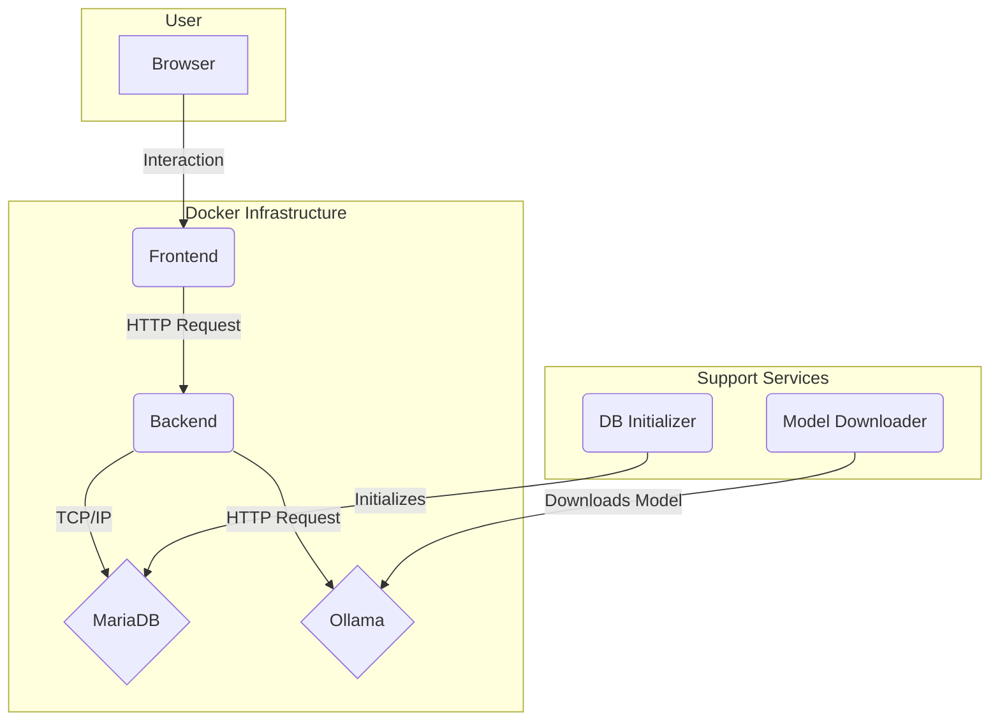

# CulturaLLM

CulturaLLM is an interactive web platform designed to explore and deepen Italian culture through a gamified question-and-answer system. The application leverages a Large Language Model (LLM) to generate responses that are compared and validated by users alongside those provided by other participants, creating a collaborative learning and community validation ecosystem.

## Architecture

The project is based on a microservices architecture managed via Docker Compose. This choice ensures modularity, scalability, and ease of deployment.



### Main Services
- **Frontend**: React.js application that provides the user interface.
- **Backend**: FastAPI (Python) based API server that handles all business logic.
- **MariaDB**: Relational database for data persistence (users, questions, answers, validations).
- **Ollama**: Serves the language model (e.g., `gemma3:1b`) for AI response generation.

### Support Services
- **db_init**: Service container that initializes the database schema on first boot, if empty.
- **ollama_model_downloader**: Service container that downloads the required LLM model if it's not already present locally.

---

## Backend (Focus: 90%)

The backend is the heart of the system and manages application logic, database interaction, and integration with the LLM model.

### Technologies Used
- **Language**: Python 3.11+
- **Web Framework**: **FastAPI** for creating high-performance and modern APIs, with automatic documentation (Swagger UI & ReDoc).
- **ORM**: **SQLAlchemy** for interaction with the MariaDB database, ensuring efficient mapping between Python objects and relational tables.
- **Data Models**: **Pydantic** for data validation, serialization, and API schema definition.
- **Authentication**: Managed via **JWT (JSON Web Tokens)**, with password hashing using `passlib`.
- **LLM Integration**: Via direct HTTP requests to the Ollama service using the `requests` library.
- **Containerization**: **Docker** for packaging the application and its dependencies.

### Project Structure
```
backend/src/backend/
├── main.py             # Entry point of the FastAPI application
├── models/
│   └── schemas.py      # SQLAlchemy models and Pydantic schemas
├── routers/
│   ├── auth.py         # Endpoint for authentication (login, registration)
│   ├── question.py     # Endpoint for question management
│   ├── answer.py       # Endpoint for submitting answers
│   ├── validate.py     # Endpoint for answer validation
│   └── leaderboard.py  # Endpoint for user leaderboard
└── services/
    ├── database.py     # Database configuration and sessions
    └── llm_service.py  # Logic for interacting with Ollama
```

### Main API Endpoints
The backend exposes a series of RESTful endpoints to manage the application flow:
- `POST /api/auth/register`: User registration.
- `POST /api/auth/login`: User login and JWT token generation.
- `GET /api/questions/random`: Gets a random question to answer.
- `POST /api/questions/`: Creates a new question (admin/moderator functionality).
- `POST /api/answers/`: Submits an answer (human or AI-generated) to a question.
- `GET /api/validate/pending`: Gets a pair of answers (human and AI) to validate.
- `POST /api/validate/`: Submits validation (score and feedback) for an answer.
- `GET /api/leaderboard/`: Gets the user leaderboard based on their scores.

### Key Business Logic

#### AI Answer Generation (`llm_service.py`)
When a user answers a question, the backend sends a request to the Ollama service. The prompt is dynamically constructed to include the cultural context and the question itself, instructing the LLM to provide a concise and relevant answer.

#### Answer Validation (`validate.py`)
This is a central process. Users (validators) receive a pair of answers (one human, one AI) for the same question. Through the interface, they assign a score that the backend records. This score contributes to the score of the user who provided the answer and to the general reliability of the model.

### Key Dependencies (`requirements.txt`)
- `fastapi`: Web framework.
- `uvicorn`: ASGI server for FastAPI.
- `sqlalchemy`, `pymysql`: Interaction with MariaDB.
- `python-jose`, `passlib[bcrypt]`: JWT management and password hashing.
- `requests`: For API calls to Ollama.
- `pydantic`: Data validation.

---

## Frontend (Focus: 10%)

The user interface is a Single Page Application (SPA) built to be responsive and intuitive.

### Technologies Used
- **UI Library**: **React.js** (v18) with functional components and Hooks.
- **Routing**: **React Router DOM** for navigation between different sections (login, dashboard, validation, etc.).
- **API Communication**: **Axios** for making HTTP calls to the FastAPI backend.
- **Styling**: Pure CSS with a BEM-like structure for maintainability.
- **Build Tool**: `react-scripts` (Create React App).

### Main Components
- **`Login`/`Register`**: Handle user authentication.
- **`Dashboard`**: Main page after login, access point to main functions.
- **`AnswerQuestion`**: Component to display a question and submit an answer.
- **`ValidateAnswers`**: Validation interface with dynamic progress bar to assign a qualitative judgment.
- **`Leaderboard`**: Displays the user leaderboard.

---

## How to Start the Project

To run the project locally, you need to have Docker and Docker Compose installed.

1. **Clone the repository**:
   ```sh
   git clone <REPOSITORY_URL>
   cd <FOLDER_NAME>
   ```

2. **Start services with Docker Compose**:
   The following command will build Docker images (if not already present) and start all containers in an orchestrated manner.
   
   You can choose between different LLM models using the `OLLAMA_MODEL` environment variable:

   ```sh
   # Use gemma3:1b (default)
   OLLAMA_MODEL=gemma3:1b docker-compose up -d

   # Use llama3.2:4b
   OLLAMA_MODEL=llama3.2:4b docker-compose up -d

   # Use mistral:7b
   OLLAMA_MODEL=mistral:7b docker-compose up -d

   # Use codellama:7b
   OLLAMA_MODEL=codellama:7b docker-compose up -d
   ```

   The `--build` option can be added to force rebuilding images, useful if dependency files (e.g., `requirements.txt` or `package.json`) have been modified:
   ```sh
   OLLAMA_MODEL=gemma3:1b docker-compose up --build
   ```

3. **Database Access**:
   To directly access the MariaDB database in the container:
   ```sh
   docker exec -it culturallm_mariadb mysql -u root -prootpassword
   ```

4. **Access the application**:
   - **Frontend**: Open your browser and navigate to `http://localhost:3000`.
   - **Backend API Docs**: The interactive API documentation (Swagger) is available at `http://localhost:5001/docs`.

5. **Stop services**:
   To stop all containers, press `CTRL+C` in the terminal where `docker-compose` is running, or execute from another terminal:
   ```sh
   docker-compose down
   ``` 
